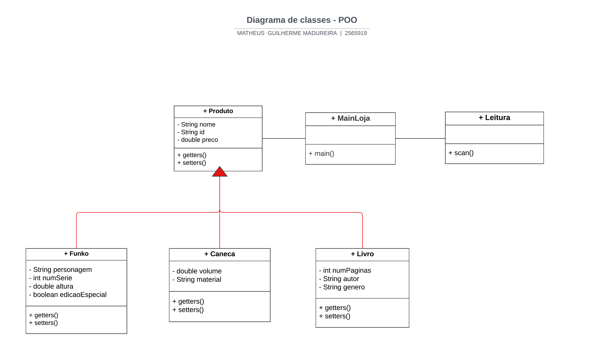

# Loja de Produtos (Funko, Livros, Canecas e Mais)

Este projeto é uma aplicação Java orientada a objetos, simulando uma loja com cadastro e gerenciamento de produtos variados como Funkos, livros e canecas. Ele foi desenvolvido com foco em boas práticas de POO, como herança, encapsulamento e tratamento de exceções personalizadas.

## Estrutura do Projeto

- O código fonte está localizado dentro da pasta `src`.
- A pasta `src/` contém todas as classes Java necessárias, incluindo:
- Produtos: `Funko`, `Livro`, `Caneca`
- Utilitários: `Leitura`, `Endereco`, `Fornecedor`
- Exceções: `PrecoNegativoExc`, `NegNumSerieException`, etc.
- Classe principal: `Principal.java`

## Como Rodar o Projeto no NetBeans

1. Abra o NetBeans IDE.
2. Vá em `File > New Project`.
3. Escolha `Java with Ant > Java Project with Existing Sources` e clique em `Next`.
4. Em **Project Name**, dê um nome como `LojaProdutos`.
5. Em **Location**, selecione a pasta raiz onde o projeto está salvo.
6. Clique em `Next` até chegar na etapa "Source Package Folders".
7. Clique em `Add Folder...` e selecione a pasta `src/`.
8. Finalize o assistente.
9. Após o projeto ser carregado, abra a classe `Principal.java` e clique com o botão direito → **Run File** para executar a aplicação.

## Diagrama de Classes

## Tecnologias Usadas
- Java 
- NetBeans IDE
- Programação Orientada a Objetos

Feito com ❤️ por **Matheus Madureira**
